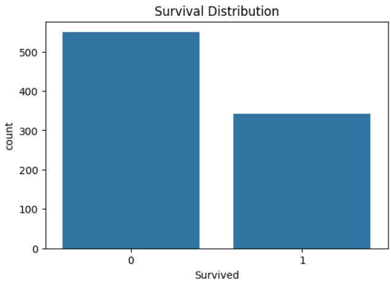
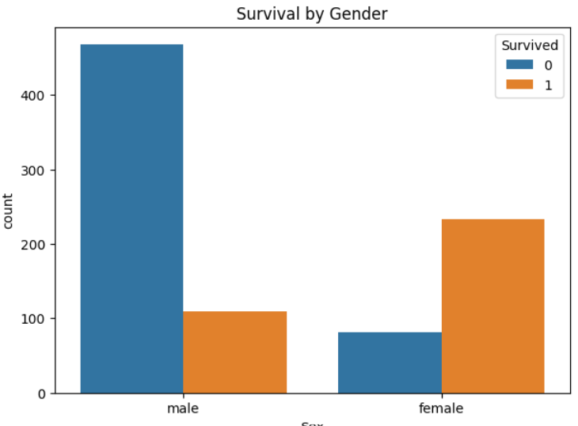
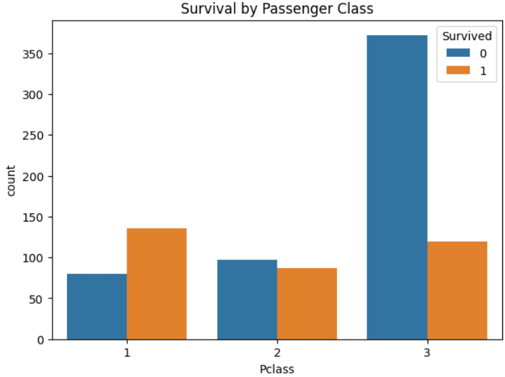
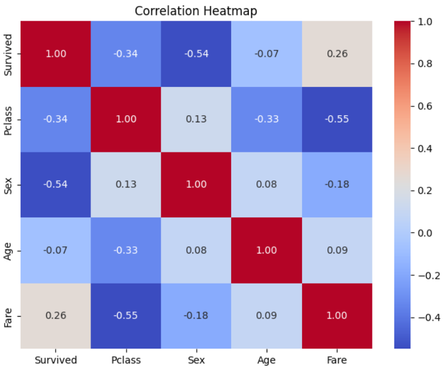
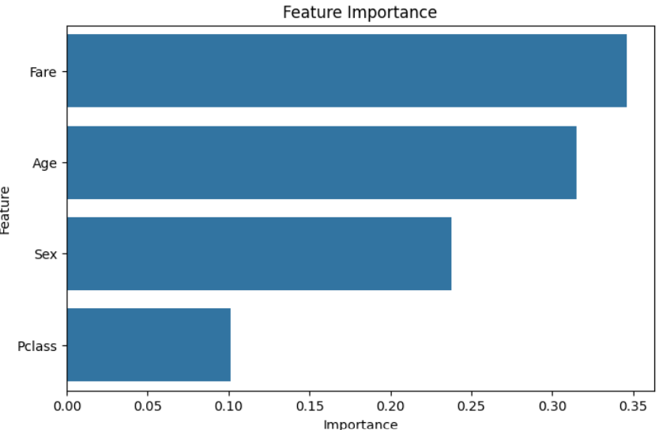

# Titanic Survival Prediction Using Machine Learning

## Project Overview

This project predicts whether a passenger survived the Titanic disaster using Machine Learning algorithms. The project follows a complete machine learning workflow including data preprocessing, exploratory data analysis (EDA), feature engineering, handling class imbalance, model training, evaluation, and feature importance analysis.

The objective is to analyze passenger information such as class, gender, age, and fare to identify the factors that influenced survival and build predictive models.

---

## Dataset

The dataset contains information about Titanic passengers, including:

* Passenger Class (Pclass)
* Gender (Sex)
* Age
* Fare
* Survival Status (Target Variable)

Target Variable:

* **0** = Did Not Survive
* **1** = Survived

---

## Technologies Used

* Python
* Pandas
* NumPy
* Matplotlib
* Seaborn
* Scikit-Learn
* Imbalanced-Learn (SMOTE)

---

## Machine Learning Workflow

### Data Preprocessing

* Selected relevant features
* Handled missing values
* Encoded categorical variables
* Applied feature scaling
* Balanced classes using SMOTE

### Exploratory Data Analysis

* Survival distribution analysis
* Gender-based survival analysis
* Passenger class survival analysis
* Correlation analysis
* Feature importance analysis

### Models Implemented

* Logistic Regression
* K-Nearest Neighbors (KNN)
* Decision Tree
* Random Forest
* Support Vector Machine (SVM)

### Evaluation Metrics

* Accuracy
* Precision
* Recall
* F1-Score
* Confusion Matrix

---

## Results & Visualizations

### Survival Distribution

This visualization shows the overall distribution of passengers who survived and those who did not survive.



---

### Survival by Gender

The analysis reveals that female passengers had a significantly higher survival rate compared to male passengers.



---

### Survival by Passenger Class

Passengers traveling in First Class had a greater chance of survival than those in Second and Third Class.



---

### Correlation Heatmap

The correlation heatmap highlights relationships between features and their influence on survival outcomes.



---

### Feature Importance

Feature importance analysis using Random Forest identifies the most influential features contributing to survival prediction.



---

## Key Findings

* Female passengers had the highest survival probability.
* First-class passengers were more likely to survive.
* Higher ticket fares were associated with better survival rates.
* Gender and Passenger Class were among the strongest predictors of survival.
* Feature engineering and SMOTE improved model performance.

---

## Future Improvements

* Hyperparameter tuning using GridSearchCV
* Cross-validation for more reliable evaluation
* Additional feature engineering
* Ensemble learning techniques
* Deployment as a web application using Flask or Streamlit

---

## Project Structure

```text
Titanic-Survival-Prediction/
│
├── Titanic_Survival_Prediction.ipynb
├── Servival_Distribution.png
├── Survival_By_Gender.png
├── Survival_By_PassengerClass.png
├── Correlation_Heatmap.png
├── Imporatnace_Of_Feature.png
├── README.md
```

---

## Conclusion

This project demonstrates an end-to-end Machine Learning pipeline for classification problems. Through data preprocessing, visualization, feature engineering, and model evaluation, the project provides valuable insights into the factors affecting passenger survival and showcases practical machine learning techniques for predictive analytics.
